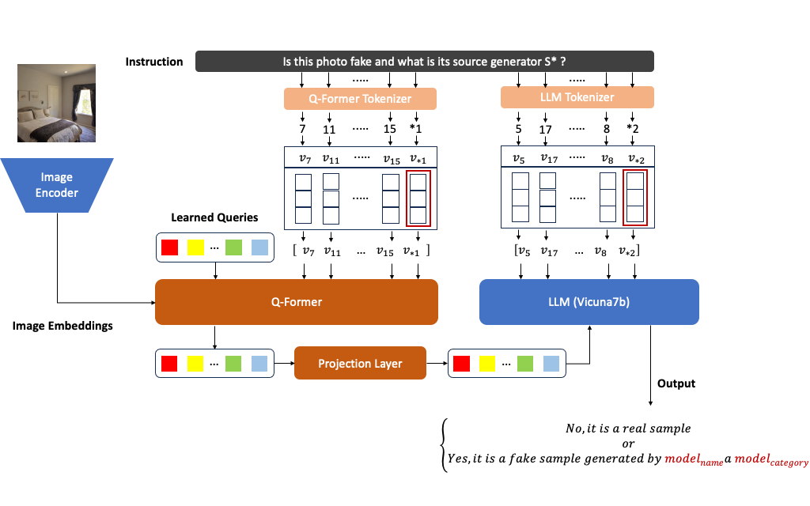

# FIDAVL: Fake Image Detection and Attribution using Vision-Language Model

This repository is an official implementation of the ICPR 2024 paper "[FIDAVL: Fake Image Detection and Attribution using Vision-Language Model](https://arxiv.org/abs/)".

☀️ If you find this work useful for your research, please kindly star our repo and cite our paper! ☀️

### TODO
We are working hard on following items.

  ✅ Release [arXiv paper](http://arxiv.org/abs/2409.03109)
- [ ] Release training scripts
- [ ] Release inference scripts
- [ ] Release checkpoints


## Introduction

In this paper, we study the problem of synthetic image (e.g., GANs and diffusion models generated images) detection and attribution.



we introduce FIDAVL, a novel and efficient multitask method designed to detect and attribute fake images to their respective source models. Leveraging a vision-language approach, FIDAVL exploits the synergies between vision and language along with soft prompt-tuning strategy to accurately detect and assign generated images to their originating source generators.

## Datasets
### Training data

To train FIDAVL, we adpot images generated by LDM, Stable Diffusion v1.4, GLIDE, ProGAN, StyleGAN, and Diff-ProjectedGAN, consisting of 1-class (bedroom) following [Towards the Detection of Diffusion Model Deepfakes](https://arxiv.org/abs/2210.14571). The original download link can be found in [here](https://github.com/jonasricker/diffusion-model-deepfake-detection). 

### Testing data
To evaluate FIDAVL, we consider the synthetic images from both GANs and diffusion models (DMs). 

* GANs dataset

  For the GANs dataset, we utilize the 5 types of GANs for testing, including ProGAN, StyleGAN, Diff-ProjectedGAN, Diff-StyleGAN2, and ProjectedGAN. 

* DMs dataset

  For the DMs dataset, we utilize 7 types of SOTA DMs, including LDM, ADM, DDPM, IDDPM, PNDM, and Stable Diffusion v1.4 and GLIDE.
  
## Acknowledgement

This project is built on the open source repository [AntifakePrompt](https://github.com/nctu-eva-lab/antifakeprompt).
Thanks them for their well-organized code!

## Citation

```bibtex
@{

}
```
